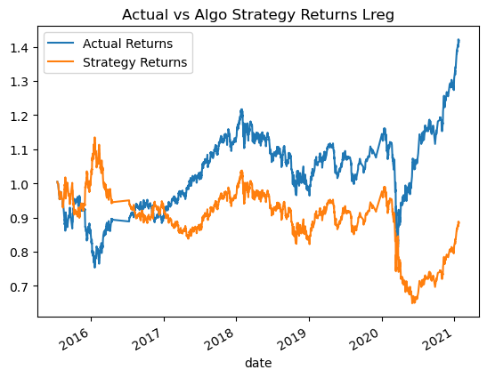

# Module_14_Algo_Bot

## The purpose of this program is to create an algo trading bot that responds to signals using the dual moving avg crossover (DMAC) strategy. Three support vector machine (svm) models and logistic regression model created, plotted, and evaluated.

=================================================
### Original Plot (Baseline performance):

### Plot after increasing training period to 6 months. Improved recall. Model is more predictive than original through late 2018, but appears to be less predictive for more recent dates:

### Plot after returning training period to 3 months, but changing short_window SMA to 10 days and long_window SMA to 150 days. This model appears most representative of actual returns:

### Plot using Logistic Regression model:

## Conclusion: The most predictive model created was the svm model using the baseline 3 month training period and a short window SMA of 10 days and a long window SMA of 150 days. The logistic regression model was inadequate as an alternative model.  
