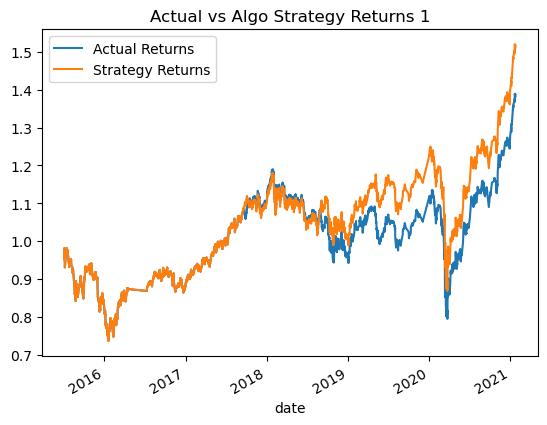
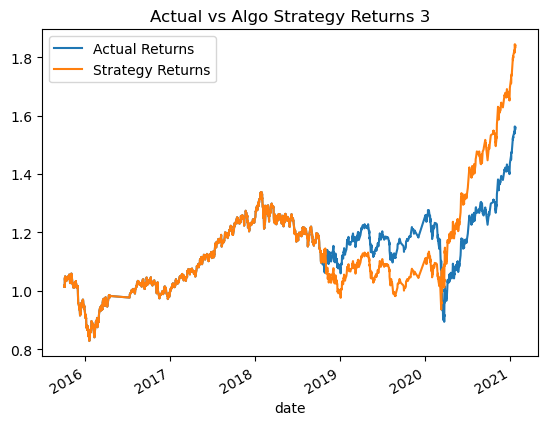

# Module_14_Algo_Bot

## The purpose of this program is to create an algo trading bot that responds to signals using the dual moving avg crossover (DMAC) strategy. 

=================================================
### Original Plot (Baseline performance)

### Plot after increasing training period to 6 months. Improved recall. Model is more predictive than original through late 2018, but appears to be less predictive for more recent dates.

### Plot after returning training period to 3 months, but changing short_window SMA to 10 days and long_window SMA to 150 days. This model appears most representative of actual returns.

